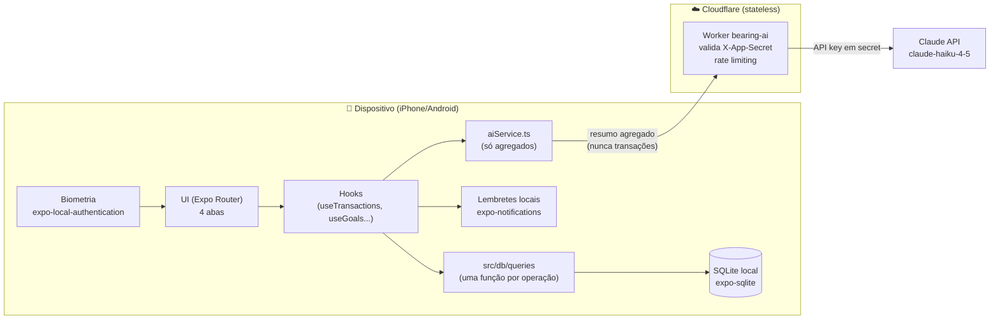

# Arquitetura

Princípio central: **local-first**. Nenhum dado financeiro sai do dispositivo, exceto o resumo agregado enviado pontualmente para gerar dicas de IA — e mesmo esse resumo não é armazenado em nenhum servidor. A decisão completa está registrada em [ADR-0001](docs/adr/0001-local-first-architecture.md).

## Diagrama

## Decisões-chave

| Camada | Escolha | Motivo |
| --- | --- | --- |
| Cliente | Expo (React Native + TypeScript), fixado no **SDK 54** | Expo Go SDK 54 continua aprovado na App Store — permite rodar no iPhone sem Apple Developer Program e sem Mac |
| Distribuição iOS | Expo Go + **EAS Update** | Publica o bundle JS na nuvem da Expo; o Expo Go já instalado carrega a versão publicada, sem rebuild |
| Distribuição Android | Expo Go (mesmo fluxo) ou APK gerado via EAS Build | Android não tem a mesma restrição de loja; pode virar app standalone quando quiser |
| Dados | `expo-sqlite`, 100% local | Elimina necessidade de backend, Auth e RLS; dados financeiros nunca saem do aparelho |
| Segurança do app | `expo-local-authentication` (Face ID / biometria) | Única camada de proteção possível já que não existe servidor guardando os dados |
| Notificações | `expo-notifications`, agendamento local | Lembretes de vencimento de parcela sem precisar de push server |
| IA | Cloudflare Worker (proxy stateless) → Claude API (`claude-haiku-4-5-20251001`) | Worker segura a API key fora do bundle do app; Haiku é o modelo mais barato adequado à tarefa |
| Controle de custo | Spend limit de US$5 em Settings > Limits no Claude Console | Teto de segurança contra abuso do endpoint |

## Fora do escopo do MVP (propositalmente)

Supabase, qualquer backend com banco na nuvem, sincronização entre dispositivos e integração com Open Finance (Pluggy) ficam documentados como **propostas** em `docs/adr/` — não como parte do MVP:

- [ADR-0002 — Proposta: sincronização entre dispositivos](docs/adr/0002-proposta-sincronizacao-entre-dispositivos.md)
- [ADR-0003 — Proposta: Open Finance via Pluggy](docs/adr/0003-proposta-open-finance-pluggy.md)
- [ADR-0004 — Proposta: metas compartilhadas](docs/adr/0004-proposta-metas-compartilhadas.md)

## ADRs

Toda decisão arquitetural relevante (nova lib, mudança de padrão, nova integração) vira um arquivo em [docs/adr/](docs/adr/), seguindo o [template](docs/adr/TEMPLATE.md). Índice atual:

| ADR | Status |
| --- | --- |
| [0001 — Arquitetura local-first](docs/adr/0001-local-first-architecture.md) | Aceito |
| [0002 — Sincronização entre dispositivos](docs/adr/0002-proposta-sincronizacao-entre-dispositivos.md) | Proposta |
| [0003 — Open Finance via Pluggy](docs/adr/0003-proposta-open-finance-pluggy.md) | Proposta |
| [0004 — Metas compartilhadas](docs/adr/0004-proposta-metas-compartilhadas.md) | Proposta |
